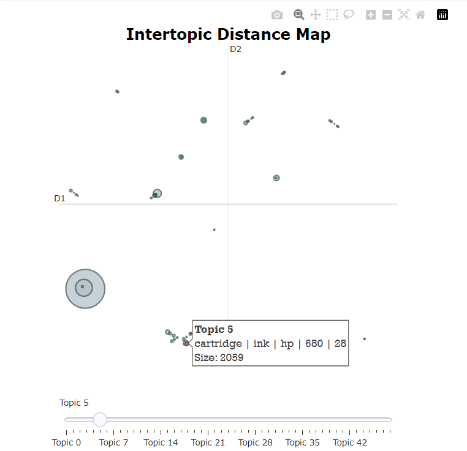

# Flipkart Product Reviews

## Sentiment Analysis (DistilBERT) | Topic Modelling 

Data : Kaggle

      https://www.kaggle.com/datasets/niraliivaghani/flipkart-product-customer-reviews-dataset
      
      
- This analysis consists of Exploratory Data Analysis for free text data from the Flipkart Product Reviews dataset. 
- Sentiment analysis was performed using DistilBERT model from huggingface by fine-tuning it for the product reviews data. 
- Topic modelling was performed using BERTopic with a spacy model for embeddings. 

------------------------------------------------------------------------------
 
 

Notebook Details: 

| Notebook  | Description |
| ------------- | ------------- |
| flipkart_pr_eda.ipynb  | Exploratory Data Analysis  |
| flipkart_pr_topic_modelling  | Topic Modelling for Product Reviews and Summary  |
| flipkart_pr_v2.ipynb  | Fine-tune DistilBERT model - local directory |
| flipkart_pr_huggingface_push.ipynb  | Fine-tune DistilBERT model - Push to Huggingface  |
| flipkart_pr_use_finetuned_huggingface_model.ipynb  | Use fine-tuned Huggingface model  |

------------------------------------------------------------------------------
 
 

## Highlights

- The counts for sentiments (Positive, Negative, Neutral) are analysed as per the price range of products. 

      
- Wordclouds analysed for product names and summary of review features.

      

      

      
       
 
      
- **DistilBERT** model fine-tuned on the data  
     Recall: 0.94 Precision: 0.94  
> **Note**
> Negation are also identified in the input string  
> E.g "I am not unhappy with this product." -> Sentiment: Positive 
     
 
       

- Topic Modelling performed for product names and summary of review features. Topics visualized in a 2D space for inter-topic distance
 
 
 

